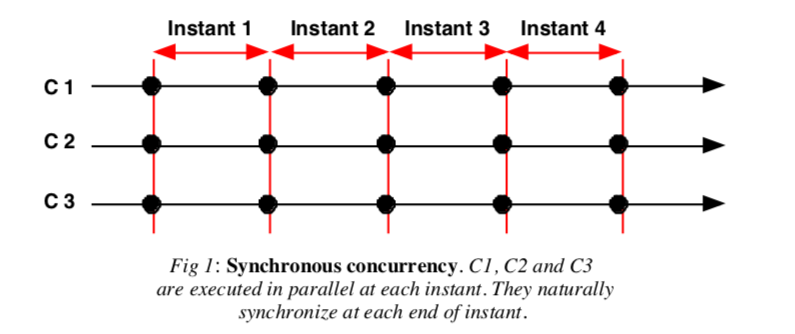
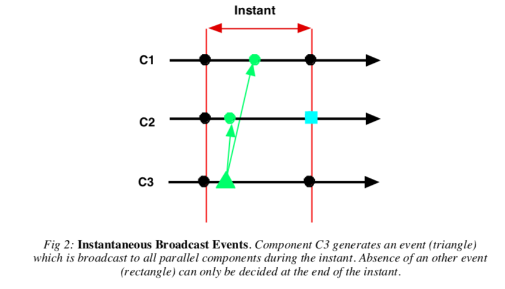
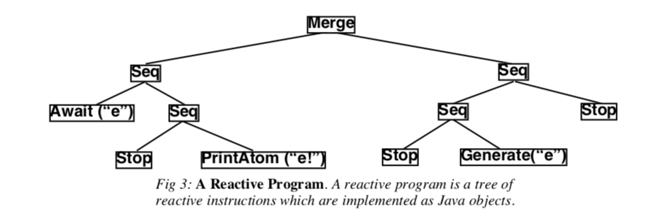
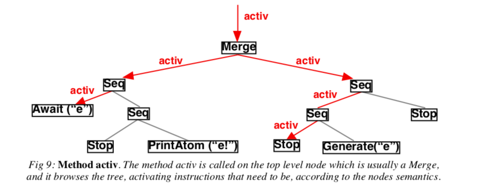
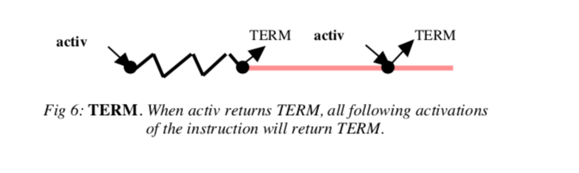
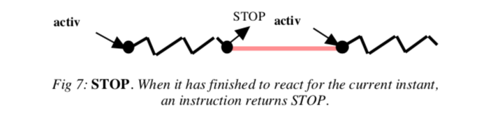
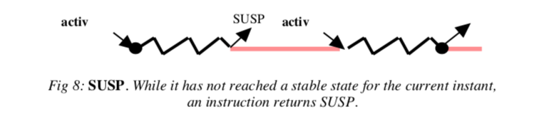

---

Title:            The SugarCubes v2.0 Reference Manual
Authors:          Jean-Ferdy SUSINI, Frédéric BOUSSINOT  
Adaptation to JS: Olivier PONS
Date:             Samedi  6 jul 2019 12:02:50 CEST

---

# The SugarCubes v2.0 Reference Manual


### Abstract: 
SugarCubes(JS) is a set of JavaScript classes used to implement reactive, event based, concurrent systems. It is a low-level basis upon which more complex reactive formalisms can be implemented. SugarCubes introduces the notion of a global logical instant of execution, which is used to define synchronous parallelism and concurrency. It is also used to define instantaneous broadcasting of events which is a powerful communication mechanism. The second release of the SugarCubes package introduces some new extensions for easy implementation of dynamic and modular systems. It also defines a more accurate interface between reactive programs and standard Java objects. Basically, it introduces the notion of a reactive object, called cube, and focus on descriptions and combinations of behaviours of such objects. SugarCubes(JS) is freely available on the Web.

----
### Keywords:
 Parallelism and Concurrency, Reactive Programming, Broadcast Events, Java, Cubes, Behaviour Combinations.
 
## 1. Introduction
SugarCubes is a set of Java[GJS] classes for implementing systems that are:

*  *Event based*. In these systems, events are instantly broadcast. Communicating in thus like in radio transmissions, where emitters send information that is instantaneously received by all other components. This communication paradigm gives a very modular way of system structuring. For example, adding a receiver to a system, or removing one from it, is totally transparent for the others components (which is not the case with other communication mechanisms like message passing or rendez-vous).

*  *Concurrent*, (but thread-less as usual in js). Parallelism is a logical programming construct to implement activities which are supposed to proceed concurrently, and not one after the other. Such parallel activities need not to be executed by distinct threads, but instead can be automatically interleaved to get the desired result. This avoids well-known thread related problems.

*  *Reactive*. Reactive systems are systems which continuously interact with their environment [HP]. A natural way of programming those systems is by combining reactive instructions whose semantics are defined by reference to activation/reaction couples identified to instants. The end of the reaction provoked by an activation gives a natural way for determining stable states, where a system is only waiting for the next activation to resume execution. An important point is that the existence of stable states is of major importance for code migration over the network.

==
In order to implement such systems, **SugarCubes** (Why the name SugarCubes? Because many people like to add some sugar in their Java...) add instants, concurrency and parallelism, and broadcast events to Javascript in accordance with the reactive paradigm ; description of it can be found on the Web at the URL http://www.inria.fr/meije/rc/. FIXME

Presently, two main applications are implemented using the **SugarCubes**:  

*  **Rsi-Java** is the implementation of **Reactive Scripts**[BH] on top of Java. Reactive Scripts gives a very flexible and powerful mean to program over the Internet especially using code migration facilities. Actually, *SugarCubes* primitives are embedded in *Reactive Scripts*. In addition, *Reactive Scripts* introduces module declarations (keyword behavior), which can be dynamically instantiated.

*   **WebIcobjs** is an implementation of **Icobj Programming. Icobjs** (for iconic objects) define a new, intuitive and fully graphical way of programming. The demo of the **WebIcobjs** is available on the Web at the URL http://www.inria.fr/meije/rc/WebIcobj/.
   
**SugarCubes v1** [BS] was the first attempt to implements the **Reactive Approach** on top of Javascript. In this paper we present **SugarCubes v2** and give most part of its code. Section 2 gives an overview of the **Reactive Approach** and of **SugarCubes v2**. Section 3 presents the two main sets of classes: Instructions and Machines. The basic reactive instructions are given in section 4. Section 5 introduces events and related instructions. Finally, sections 6 to 10 describe the new features of **SugarCubes v2**.

SugarCubes is freely distributed as a tool box for reactive programming in Javascript.

## 2. The Reactive Approach
Reactive formalisms introduce the notion of an *instant* of execution, also called reaction, which splits program execution in logical instants. A reactive program is activated in an environment and it reacts to the activation by performing one instant of execution. This notion of a logical instant is of a major importance in the **Reactive Approach** as it allows the definition of *synchronous concurrency*: during a reaction, (during the execution of an instant) all parallel components execute one step of execution corresponding to that instant. Thus, they synchronize at each end of instant which occurs when all components have terminated their execution for the current instant. This leads to interleaved executions simulating parallelism.




A powerful communication mechanism called *instantaneous broadcasting of events* is defined using logical instants of execution. It has a clear semantics:

* *instantaneity*: events are **non persistent** instantaneous data, only available during the very instant of their generation;
* *broadcast*: events are seen in the same coherent state by all parallel components in the system during the whole instant. An event cannot be seen absent by some components and present by some others during the same instant.



Components waiting for a generated event can immediately react to its presence. This is called *instantaneous reaction to presence*. On the contrary, components waiting for an absent event cannot immediately react to its absence, as absence cannot be decided before the end of the instant. Thus, reaction to the absence is postponed to the next instant. This is called delayed *reaction to absence*. Note that *forbidding instantaneous reaction to the absence* of an event is a way to avoid causality problems (present in the *Synchronous Approach* [HAL]). Causality problems are incoherent situations in which one can react immediately to the absence of an event by immediately generating it. More information on this subject can be found in [BG] or [HAL].

Finally, instants provide a clear semantics to simultaneity of events during one instant: two events are simultaneous if they are present during the instant

### 2.1. SugarCubes overview

**SugarCubes** programs (also called behaviors) are made of reactive instructions implemented as pure Java objects; from this point of view, **SugarCubes** is more a high level language, built on top of Javascript, than a standard API. A reactive program is a tree of objects representing the syntax of the program. Each node is an instruction as in the following figure:



In the following, reactive instructions and reactive programs will be considered as synonymous.

####Activation of a reactive instruction
An instruction is activated by a call to its method *activ*. It transmits activation to its sub-terms, following the syntax tree; this is shown on the example:
 



Each reactive instruction activation returns **TERM**, **STOP**, or **SUSP** representing the state of the instruction after activation; these return codes are interpreted as follows:

* **TERM** (for *terminated*) means that execution of the instruction is completed. Thus, activating it at following instants will have no effect and will again return TERM.



* **STOP** (for *stopped*) means that execution of the instruction is stopped at a stable state for the current instant. At the next instant, execution restarts from the instruction following the stop. It is like the stop road sign: in front of the stop sign, cars must stop before resuming.



* **SUSP** (for *suspended*) means that execution of the instruction has not reached a stable state for the current instant, and has to resume during this instant. This is, for example, the case when awaiting for a not yet generated event (see section 5.3): execution then suspends to give other components the opportunity to generate it.




### 2.2. SugarCubes v2
**SugarCubes v2** basically introduces four extensions to the reactive paradigm: the Shell, Freeze, Link, and Cube instructions.

**SugarCubes v2** also introduces the notion of a *named instruction* which can be referenced by its name in reactive machines. Instruction names are Java strings. The present version of SugarCubes does not make any assumption on the way names are managed; in particular, machines do not verify that two distincts instructions have two distinct names; it is the programmer responsibility to assure this, if needed.

In this section, we overview the extensions which are described in details in sections 6 to 10 of this document.


#### 2.2.1. Shell Instruction
*Shells* are named instructions in which it is possible to dynamically add new parallel instructions.The key point is that addings are not immediately performed, but are delayed to the next instant; thus, execution of the current instant is not perturbed and does not depend on the moments addings actually take place.

Implementation is as follows: during each instant, all *add orders* (`AddToShell` instructions described in section 8) are collected by the machine and placed into a buffer of instructions; at the end of the instant, instructions in the buffer are put in parallel with the shell program; thus, added instructions will be actually started only at the next instant.

#### 2.2.2. Freezing a program

In SugarCubes v2, freezable instructions are named instructions which are frozen when freeze orders are issued on them. In response to a freeze order, execution of a freezable instruction is stopped at the end of instant and the remaining program (the residual) is removed from the system. The residual is stored in the environment and can be retrieved from it for future use. This mechanism is especially useful to implement code migration and persistency mechanisms. The key point is that residuals are computed after the setting of the end of instant, when instructions are in stable states.

Freeze order are raised by Freeze instructions (see section 9 for details). All freeze orders executed during an instant are accumulated by the execution machine which start a freeze process at the end of the instant. Like for activations, the freeze process browses the program tree, starting from the top level instruction. Each time a freezable instruction is reached, the execution machine checks if a freeze order has been raised for it during the instant. If so, the freezable instruction is removed from the system and its residual (described bellow) is computed and stored in the environment

Computing the residual of a frozen instruction means to browse the instruction body and create a new instruction corresponding to what remains to do in the instruction.


#### 2.2.3. Link
Reactive instructions do not directly perform data computations which must be handled by standard Java objects. A link encapsulates a Java object and a reactive behaviour in the same instruction. The associated object becomes the default object with which the reactive instruction interacts.

####2.2.5. Cube

A Cube is the encapsulation in the same entity of a standard Java object and of a dynamic reactive behaviour. Cubes are autonomous instructions run in parallel in the system and communicating using broadcast events. A Cube is actually the combination of a link, and of a shell, and it is also a basic unit of migration (that is to say, a Cube is a freezable instruction):


$$Cube = Freezable + Link + Shell$$


Reactive machines, called event machines in **SugarCubes v2**, are actually cubes. However they are special closed cubes which limit the scope of events, and of freeze and add orders.

The rest of the paper gives a technical view of **SugarCubes v2**, presenting and commenting most part of the code of the different classes.

## 3. The Main Classes

**SugarCubes** is divided in two main set of Java classes:

*  Reactive Instructions are objects implementing reactive primitives, for example, the sequence operator, the concurrency operator, loops instructions, generation of an event, preemption by events, etc.
*  
* Reactive Machines are objects used to execute programs made of reactive instructions and to provide their execution environment. Basically, a reactive machine activates its program, defines its instants, and provides the event environment and default Java object for it.


All classes presented here are parts of the package inria.meije.rc.sugarcubes.

### 3.1. Reactive Instructions
An instruction defines a reactive behaviour. It is a Java object implementing the interface Instruction. 

#### 3.1.1. Instruction Interface
This interface defines methods, called by reactive machines, in order to manage and execute instructions.


```java	
package inria.meije.rc.sugarcubes;
public interface Instruction extends Cloneable,Java.io.Serializable {
byte activ(Context context);
boolean isTerminated(); 
Object clone();
void freeze(Context context); 
Instruction residual();
void notifyWarmUpToJava(Context context); 
void notifyFreezeToJava(Context context); 
void notifyTerminationToJava(Context context);
}
```

Each activation returns a code which is the state of the instruction after activation. There are three return codes defined in the ReturnCodes interface:

```java
public interface ReturnCodes {
byte STOP = 0;
byte TERM = 1;
 byte SUSP = 2;
}
```


##### Activation
An instruction is activated by calling its method *activ*. When activated, the instruction receives the execution environment (which implements the Context interface described in the next sub-section) as argument and it executes its behaviour.

##### isTerminated
Method isTerminated returns a boolean indicating if the instruction has terminated, without having to activate it.

##### Clone and Serialization
Instruction extends interface Cloneable and thus instruction copies are available by calling the method clone. It also extends interface Serializable for translating instructions into byte streams (this can be useful to implement code migration on the top of Java RMI or code persistence mechanisms).

##### Freeze
At the end of each instant, reactive machines invoke method freeze on their programs. Method freeze bowses the program tree and calls the method freeze of all instructions that have been activated and not terminated during the instant; the effect of these calls is describe in section 9.1. Informally, it is as follows:

* the instruction computes its residual (see method residual bellow);
* it stores the residual in the current context, using method storeFrozenInstruction (see the Context
interface description in next section).
* it removes itself from the executed program;


##### Residual
Method residual, called at ends of instants on frozen instructions, returns the remaining of the instruction (what remains to be done at next instants).

##### Notifications to Java
Method notifyFreezeToJava is called by the machine on instructions that have to be frozen. It executes some Java code just before freezing instructions (note that this Java code is executed between instants). Typically this method is useful to remove the references on objects associated to frozen instructions (for example to implement a *dynamic binding mechanism* for code migration).
Method notifyTerminationToJava is called when instructions terminate or are destroyed. It is useful to execute some Java code in order to inform associated Java objects that reactive instructions are over.
Method notifyWarmUpToJava handles Java code executed when the residual of an instruction is added back in an execution machine. It executes Java code allowing for example a Java object bound to the reactive instruction to proceed to some reinitialisation process (essentially, dynamic rebinding of the Java object) before resuming. This code is executed only at the very first activation of the newly added back instruction.


#### 3.1.2. Instruction Implementation
Class InstructionImpl implements interface Instruction; it is an abstract class that implements common basic methods of an instruction. It also implements method toString which produces readable representations of reactive programs; actually, programs are printed as **Reactive Scripts**. All reactive instructions extends the class *InstructionImpl* which has the following structure:

```java
abstract public class InstructionImpl implements Instruction, ReturnCodes {
protected boolean terminated = false; 
protected boolean firstActivation = true;
public boolean isTerminated(){ return terminated; }
abstract protected byte activation(Context context);
protected void firstActivation(Context context){ firstActivation = false; } public byte activ(Context context){
	if (terminated) return TERM;
	if 	(firstActivation) firstActivation(context); 
	byte res = 	activation(context);
	if (res == TERM) lastActivation(context); return res;
}	
protected void lastActivation(Context context){ terminated = true; } 
public String toString(){ return ""; }
...
public Object clone(){
	try{ return (Instruction)super.clone(); } 
	catch (CloneNotSupportedException e){
	throw new InternalError(e.toString()); }
	}	
... 
}
```


Note that method activ calls activation which is abstract and must be defined in derived classes. These two methods receive a Context parameter for interacting with the execution environment.

Note also that firstActivation and lastActivation allow subclasses to proceed special activities when the instruction is activated for the very first time and for the last time.


Two abstract classes extends *InstructionImpl*: *UnaryInstruction* and *BinaryInstruction*. 

##### Unary Instructions
UnaryInstruction is an abstract class with a body which is also an instruction. It is used for example to define loops in section 4.5.

```java
abstract public class UnaryInstruction extends InstructionImpl {
	protected Instruction body = new Nothing();`
	public Object clone(){
	UnaryInstruction inst = (UnaryInstruction)super.clone(); 
		inst.body = (Instruction)body.clone();
	return inst;
}	
	protected byte activation(Context context){
		return body.activ(context); }
... 
}	
```


##### Binary Instructions
BinaryInstruction is an abstract class with two components, left and right, which are also instructions. It is used, for example, to define the binary sequence instruction in section 4.2.

```java
abstract public class BinaryInstruction extends InstructionImpl {
protected Instruction left = new Nothing(), right = new Nothing();
public Object clone(){
	BinaryInstruction inst = (BinaryInstruction)super.clone(); 
	inst.left = (Instruction)left.clone();
	inst.right = (Instruction)right.clone();
	return inst;
	} 	
}
```


##### Named Instructions
In SugarCubes v2, shells, cubes, and freezable instructions implements the NamedInstruction interface and can be identified by a name.

```java
public interface NamedInstruction extends Instruction {
String name(); }
```	

### 3.2. Reactive Machines
Reactive instructions are executed by execution machines called reactive machines. A reactive machine is a Java object owning a program which is an instruction. It provides and manages the execution environment for the program and it defines the instants of execution for it.


#### 3.2.1. Machine Interface
A reactive machine is an execution machine that runs a reactive program. Reactive machines implement the
Machine interface:

```java
public interface Machine {
public Instruction program();
boolean react();
 }
```
Method program returns the program of the reactive machine. Method react executes one reaction, that is one instant of the program. Method react returns a boolean value which indicates if the machine is terminated (i.e. the program is completely terminated).


#### 3.2.2. Context Interface
Reactive machines implement the Context interface:

```java
public interface Context {
void newMove();
int currentInstant();
 boolean isEndOfInstant();
void setCurrentLink(Link link);
 Link currentLink();
void addToShell(String name,Instruction inst); 
void registerShell(String name,Shell shell); 
void removeShell(String name);
void freezeOrder(String name);
boolean isToBeFrozen(String name);
void storeFrozenInstruction(String name,Instruction frozen); 
Instruction getFrozenInstruction(String name);
}
```


##### Instants processing
Two methods are used to detect ends of instants: newMove indicates that something new happens in the program; thus, the end of the current instant has to be postponed; isEndOfInstant returns a boolean to indicate if the end of the current instant has been declared by the execution machine.


Method currentInstant returns the number of the current instant (initially equals to 1). 

##### Links processing
Methods setCurrentLink and *currentLink* bind and retrieve the *Link* instruction which associates a Java object to a reactive program. This mechanism is detailed in section 6.

##### Shells processing
Methods *addToShell*, *registerShell*, and *removeShell* are used to implement dynamic parallelism with which new instructions can be added to shells; this is detailed later in the section about *shells* (7). Actual adding of instructions is performed between instants. Machines are responsible to collect all add orders during a reaction and to actually proceed them at the end of the reaction.

##### Freeze orders
Method freezeOrder adds the name of an instruction to the set of instructions having to be frozen at the end of the reaction. It is usually called by the Freeze instruction (see section 9). Method isToBeFrozen is called by an instruction, when the instant is over, to know if it has to be frozen. If true, the instruction proceeds the freeze order as described in the previous subsection (about instructions). Method storeFrozenInstruction stores the residual of a frozen instruction in the execution context. Finally, getFrozenInstruction retrieves the residual of a frozen instruction. Note that calling getFrozenInstruction to retreive a recently frozen instruction also removes this instruction from the frozen instructions pool in the environment; so, it can be called only once to retreive a particular instruction.
#### 3.2.2. Event Machines

Execution machine of class *EventMachine* implements interfaces *Machine* and Context. It provides an event environment for reactive programs and detects ends of instants.
##### Method react

Method *react* of `EventMachine` is as follows:

* The program is cyclically activated while there are suspended instructions in it (that is, while activations
return SUSP).
* At the end of each program activation, the machine tests if some new events were generated during this execution. If it was not the case, then there is no hope that future program activations will change the situation, and the end of the current instant can be safely decided. Then, a flag is set to let suspended instructions stop, knowing from that point that awaited events are absent. As the instant is over, reactions to the absence of events are postponed to the next instant.
* The end of the current instant is effective when all parallel instructions in the program are terminated or stopped (no suspended instruction remains).
Two variables move and endOfInstant are used to implement this algorithm with the simple following code:

```java
while ((res = program.activ(this)) == SUSP){
if (move) move = false; else endOfInstant = true;
}
```

##### Method add
In SugarCubes v2, execution machines are instructions and more precisely *cubes* (see section 10).

Initially the program of a machine is the *Nothing* instruction (defined in section 4.1) which does nothing and terminates immediately. The method add adds a new instruction to the program; this new instruction is run in parallel with the previous program, using the Merge primitive defined in section 4.3.

##### Event environment

EventMachine contains an environment named eventEnv to deal with events (events are described later in section 5). It implements the interface Domain to allow reactive instructions to access the event environment.


Class EventMachine
Class EventMachine has the following structure:

```java
public class EventMachine extends Cube implements Domain, Machine {
	protected transient boolean move=false,endOfInstant=false, 	beginingOfInstant=true;
	protected int instant = 1; ...

	public EventMachine(){
		 super("noname", new Nothing());
		 	 }
   public EventMachine(Instruction i){ super("noname",i); } 
   ...

	public void add(Instruction inst){ synchronized(this){
		if(addToProgram!=null)
	addToProgram = new Merge(addToProgram,inst);
	else
	addToProgram = inst;
	...	
	public int currentInstant(){ return instant; }
	public void newMove(){ move = true; }
	protected void newInstant(){ instant++; 	presentEvents.removeAllElements(); } ...
	
	protected byte activation(Context context){
		move = false;
		if(beginingOfInstant){
			notifyBeginOfInstantToJava();
			beginingOfInstant = false;
	 }	
	...
	byte res = super.activation(this); 
		if (res == STOP){
			endOfInstant = false; newInstant();
	       ... 	
		notifyEndOfInstantToJava();
		 beginingOfInstant = true;
	}
	else if(res == SUSP){
if (!move) endOfInstant = true;
context.newMove(); }
return res; }
...

public boolean isEndOfInstant(){ return endOfInstant; } ...

public boolean react(){
byte res = SUSP;
while (res == SUSP) res = activ(this); return res == TERM ? true : false;
}

public Instruction program(){
return body();


}
...
public Object clone(){
	EventMachine inst = (EventMachine)super.clone();
	...
	inst.addToProgram = (Instruction) addToProgram.clone(); return inst;
	}
}	
```


#### 3.2.3. Processing of instants
Finally, in SugarCubes, execution machines allow the user to implement special tasks performed at the beginning or at the end of instants by overridding the two methods notifyBeginOfInstantToJava and notifyEndOfInstantToJava. This can be for example useful to perform periodic graphics refreshes at each instant.


## 4. Basic Instructions


In this section, we introduce the basic reactive instructions.  

### 4.1. Nothing, Stop, Halt
Nothing does nothing when activated and immediatly returns TERM; it is introduced only as the initial program value: 
 
```javascript
public class Nothing extends InstructionImpl {
public String toString(){ return "nothing"; }
protected byte activation(Context context){ return TERM; } }
Stop stops execution for the current instant by returning STOP. It will return TERM at next instants:
public class Stop extends InstructionImpl {
protected boolean ended = false;
public String toString(){ return "stop"; } protected byte activation(Context context){


if (ended) return TERM; ended = true;
return STOP;
} 
}
```


Instruction *Halt* return **STOP** at each activation (and thus never terminates):  

```javasript
public class Halt extends InstructionImpl {
public String toString(){ return "halt"; }
protected byte activation(Context context){ return STOP; } }

```


### 4.2. Sequencing
Class Seq extends BinaryInstruction and implements sequencing. First, instruction left is activated; if it terminates, then control immediately (during the same instant) goes to right:

```javascript
public class Seq extends BinaryInstruction {
public Seq (Instruction left,Instruction right){ this.left = left;
this.right = right;
}
public String toString(){ return left+"; "+right; } ...
protected byte activation(Context context){
if (left.isTerminated()) return right.activ(context); byte res = left.activ(context);
if (res != TERM) return res;
return right.activ(context);
}
... }

```


### 4.3. Parallelism
Class Merge extends BinaryInstruction and implements basic parallelism: at each instant, the two instructions left and then right are both activated, always in this order. It terminates when both left and right are terminated. The return code of method activ is determined, from the return states of the two branches, by the following table:


| right\left | TERM | STOP |SUSP|
|------------|------|------|----|
|TERM        | TERM | STOP |SUSP|
|STOP        | STOP | STOP |SUSP|
|SUSP        | SUSP | SUSP |SUSP|


Class Merge has the following structure:

```javascript
public class Merge extends BinaryInstruction {
private byte leftStatus = SUSP, rightStatus = SUSP;
public Merge (Instruction left, Instruction right){ super.left = left;
super.right = right;
}
public String toString(){ return "("+left+" || "+right+")"; } ...
protected byte activation(Context context){
if (leftStatus == SUSP) leftStatus = left.activ(context);
if (rightStatus == SUSP) rightStatus = right.activ(context); if (leftStatus == TERM && rightStatus == TERM){ return TERM; } if (leftStatus == SUSP || rightStatus == SUSP){ return SUSP; } leftStatus = rightStatus = SUSP;
return STOP;
}

... }

```

### 4.4. Atoms
Abstract class Atom extends InstructionImpl and defines actions which implement interactions and side- effects with the execution environment. Typically, atoms are used to implement event generations and interactions with standard Java objects.

```javascript
abstract public class Atom extends InstructionImpl {
abstract protected void action(Context context);
protected byte activation(Context context){ action(context); return TERM; } }
Class PrintAtom, for example, extends Atom to display a message on the standard output stream: package inria.meije.rc.io;
import inria.meije.rc.sugarcubes.*;
public class PrintAtom extends Atom {
private String message;
public PrintAtom(String m){ message = m; }
public String toString(){ return "{System.out.print(\""+message+"\")}"; } protected void action(Context context) {
System.out.print(message); System.out.flush(); }
}

```

Note that in SugarCubes v2, PrintAtom has been moved to the inria.meije.rc.io package as its purpose is essentially to generate traces of execution (for testing or debugging). Another instruction PrintTime, can be also used for profiling purposes.


### 4.5. Cyclic Instructions
SugarCubes provides two kinds of loops: infinite loops and finite ones; both extend the abstract class Cyclic,
which has the following structure:

```javascript
public class Cyclic extends UnaryInstruction {
protected Instruction model = null;
public Cyclic(Instruction inst){ model = inst; body = freshBody(); }
protected Instruction freshBody(){ return (Instruction)model.clone(); } }

```

Note that each iteration of a cyclic instruction uses a new fresh copy of the initial body (called the model).


### 4.6. Infinite loops
When the body of an infinite loop of class Loop is terminated, it is automatically and immediately restarted.

#### Instantaneous loops
A loop is said to be instantaneous when it cannot terminate its reaction for the current instant in a finite time because its body terminates and is restarted for ever. Instantaneous loops are to be rejected because they would never converge to a stable state closing the instant.
To avoid instantaneous loops we use the following heuristics: a loop enforces a stop to occur at the end of the execution of the body if the beginning of it has also been previously executed during the same instant. This is a valid strategy because all successive iterations would probably also terminate during the same instant, leading to an instantaneous loop.
#### Class Loop


Class Loop is the following:

```javascript


public class Loop extends Cyclic {
protected boolean first = true, endReached = false; public Loop(Instruction inst){ super(inst); }
public String toString(){ return "loop "+body+" end"; } protected Instruction rest(){
return new Seq(body.residual(),new Loop(freshBody())); }
protected byte activation(Context context){ for(;;){
byte res = body.activ(context); if (res != TERM){
first = endReached = false;
return res; }
if (first || endReached){
System.err.println("warning: instantaneous loop detected"); first = endReached = false;
return STOP;
}
endReached = true;
 body = freshBody();

} }
}
```

#### 4.7. Finite Loops
Finite loops are implemented by the class Repeat. A finite loop executes its body a fixed number of times. Therefore, there is no detection of instantaneous looping, because finite loops cannot diverge.

```javascript
public class Repeat extends Cyclic {
protected int counter;
protected JavaIntegerExpression intExp;
public Repeat(int n,Instruction inst){ this(new JavaIntegerValue(n),inst); } public Repeat(JavaIntegerExpression exp,Instruction body){
super(body); intExp = exp; }

protected Instruction rest(){
if (counter <= 1) return body.residual();
return new Seq(body.residual(),new Repeat(counter-1,freshBody()));
}
public String toString(){ return "loop "+intExp+" times "+body+" end"; } public void firstActivation(Context context){
counter = intExp.evaluate(context.currentLink());
super.firstActivation(context); }

protected byte activation(Context context){ for(;;){
if (counter <= 0){ return TERM; }
 byte res = body.activ(context); 
 if (res != TERM) return res; 
 counter--; body = freshBody();
}
}
}
```
The number of iterations is determinated at run time, when using the constructor having a JavaIntegerExpression parameter. The number of iterations is then computed when the loop is activated for the first time. More details about JavaIntegerExpression can be found in section 7.


####4.8. If
Class *If* extends *BinaryInstruction* and allows execution to choose between *the then branch* (**left**) or *the else branch* (**right**) according to the evaluation of a boolean expression. The boolean expression is computed by an object implementing the *JavaBooleanExpression* interface (see section 6.2). Code of class *If* is:

```javascript
public class If extends BinaryInstruction {
protected boolean value; protected JavaBooleanExpression
public If(JavaBooleanExpression condition = cond; left = t;
}
public If(JavaBooleanExpression
this(cond,t,new Nothing()); }
public String toString(){
if (right instanceof Nothing)
if (left instanceof Nothing) return "if "+condition+" else "+right+" end"; return "if "+condition+" then "+left+" else "+right+" end";
}
...
protected void firstActivation(Context context){
value = condition.evaluate(context.currentLink());
super.firstActivation(context); }
protected byte activation(Context context){
return value ? left.activ(context) : right.activ(context);
}
... }

```


### 4.9. An Example
The little example we consider here consists in running three instants of a machine. First, one defines the machine and an instruction using the primitives *Stop*, *Seq*, *Merge*, and *PrintAtom*; then, the instruction is added to the machine; finally, three machine activations are provoked.

```javascript
class Example {
public static void main (String argv[]) {
EventMachine machine = new EventMachine();
Instruction inst = new Seq(
new Merge(
new Seq(new Stop(),new PrintAtom("left ")), new PrintAtom("right ")),
new PrintAtom("end "));
machine.add(inst);
for (int i = 1; i<4; i++){ System.out.print("instant "+i+": "); machine.react(); System.out.println("");
} }
}
```


Execution of this class gives:

	instant 1: right 
	instant 2: left end
 	instant 3:


Note that termination of *Merge* only occurs at the second instant because of the *Stop* instruction in the first branch. Note also that printing of *end* occurs in the second instant: sequencing is instantaneous, that is control goes to the second component of the sequence as soon as the first one terminates.

A call to the method *toString* of instruction inst would produce the following reactive script, which is actually a more readable form of the instruction:

```

(
stop;{System.out.print("left ")}
||
{System.out.print("right ")}
);
{System.out.print("end ")}
```

## 5. Event Programming
SugarCubes provides a powerful mechanism of communication, called *instantaneous broadcasting of events*.

First, we consider events, then reactive instructions dealing with them

### 5.1. Events
**SugarCubes** provide events with the following characteristics:

* events are automatically reset at the beginning of each instant; thus, events are not persistent data across instants.
* events can be generated by the method generate of the Domain interface (implemented by reactive machines). This sets an event to be present for the current instant. Generating an event which is already present has no effect.
* an event is perceived in the same way by all parallel components during the instant: events are broadcast.
* events can be tested for presence, waited for, or used to preempt a reactive statement.
* one cannot decide that an event is absent during the current instant before the end of this instant (this is the only moment one is sure that the event has not been generated during the instant). Thus, *reaction to absence is always postponed to the next instant*. This is the basic principle of the reactive approach.


### 5.2. Interface Domain
*EventMachine* implements interface *Domain* which defines methods used to interact with the event environment. This interface is an extension of Context.

```javascript
public interface Domain extends Context {
boolean isGenerated(String name); void generate(String name);
...
}
```

Method *generate* generates an event. Method *isGenerated* returns true if the event given in argument has been generated during the current instant; it returns false otherwise.
Note: if *isGenerated* return false, it doesn’t mean that the event is absent, which can only be decided at the end of the instant; it only means that the event has not yet been generated.


### 5.3. Configurations
In SugarCubes, events are handled by event configurations. Intuitively, a configuration is a boolean expression of events. A configuration is satisfied if it evaluates to true; else, it is unsatisfied. Event configurations are of 4 kinds:

* a simple event (class *PosConfig*), satisfied if the event is present.
* the negation *not* of a configuration (class *NotConfig*) satisfied if its sub-configuration is unsatisfied.
* the *and* of two configurations (class *AndConfig*) satified when the two sub-configurations are both satisfied in the same instant.
* the *or* of two configurations (class *OrConfig*) statisfied when one of the two sub-configurations is satisfied.
* 
Event configurations extend the abstract class *Config* which describes the basic methods common to all configurations.

#### 5.3.1. Class Config

```javascript
Abstract class Config has the structure:
abstract public class Config implements Cloneable,Java.io.Serializable {
abstract public boolean fixed(Domain domain); 
abstract public boolean evaluate(Domain domain); ...
}
```

A configuration is said to be *fixed* when its value can be *safely* evaluated.

Note: Only fixed configurations should be evaluated. Evaluation is performed by method **evaluate** (which thus should be called only on fixed configurations).


#### 5.3.2. Class PosConfig
A PosConfig configuration is fixed as soon as the corresponding event is generated, or when the end of the current instant is set. Evaluation returns true if the event is generated, and false if the event is absent, that is, it is not present while end of the current instant is set.

```javascript
public class PosConfig extends Config {
protected String eventName = null;
protected JavaStringExpression eventNameToEvaluate = null;
public PosConfig(String eventName){ this(new JavaStringValue(eventName)); } public PosConfig(JavaStringExpression expr){ eventNameToEvaluate = expr;}
public String toString(){ return eventNameToEvaluate.toString(); } public boolean evaluate(Domain domain){
return domain.isGenerated(eventName); }
protected void computeName(Domain domain){
eventName = eventNameToEvaluate.evaluate(domain.currentLink()); eventNameToEvaluate = new JavaStringValue(eventName);
}
public boolean fixed(Domain domain){
if(eventName == null) computeName(domain);
return domain.isGenerated(eventName)?true:domain.isEndOfInstant(); }
}

```
The name of the actual event is computed at run time when the constructor with a *JavaStringExpression* parameter is used (*JavaStringExpression* is considered in section 6).

**Note**: PosConfig is the only class that directly seeks events in the environment.

#### 5.3.3. Class NotConfig
Class *NotConfig* extends *Config* and implements the negation of a sub-configuration. It is fixed as soon as the
sub-configuration is, and evaluation returns the negation of it.

#### 5.3.4. Binary configurations
Binary configurations are conjunctions (*and*) or disjunctions (*or*) of configurations. The *BinaryConfig* abstract class contains two fields *c1* and *c2* of type *Config*.


A conjunction of class *AndConfig* is fixed when both sub-configurations are, or as soon as one component is fixed and evaluates to false: in this case, the other one does not need to be also fixed. Evaluation returns the *and* of the evaluation of the two sub-configurations:

```javascript
public class AndConfig extends BinaryConfig {
public AndConfig(Config c1, Config c2){super(c1,c2);}
public String toString(){ return "("+c1+" and "+c2+")"; } public boolean fixed(Domain domain){
boolean b1 = c1.fixed(domain);
boolean b2 = c2.fixed(domain);
if (b1 && !c1.evaluate(domain)) return true; if (b2 && !c2.evaluate(domain)) return true; return b1 && b2;
}
public boolean evaluate(Domain domain){
return c1.evaluate(domain) && c2.evaluate(domain); }
}

```

Class *OrConfig* of configuration disjunctions is not given here as it is very similar to *AndConfig*.


### 5.4. Event Generation
Class *Generate* extends *Atom* (event generation terminates instantaneously). Generating an event calls the newMove method to indicate that something new happens in the system; this avoid the execution machine to decide the end of the instant at the end of the current activation. Thus, configurations waiting for the event will still have the possibility, during the current instant, to see that it is actually present.


```javascript
public class Generate extends Atom {
protected JavaStringExpression eventName = null;
public Generate(String e) { this(new JavaStringValue(e)); } public Generate(JavaStringExpression jsi){ eventName = jsi;}
public String toString(){
return "generate "+eventName;
}
protected void action(Context context){
((Domain)context).generate(eventName.evaluate(context.currentLink())); }
}
```
The name of the generated event is set at run time when the constructor with a JavaStringExpression
parameter is used (see section 6).
### 5.5. Waiting for Events
Class Await extends InstructionImpl and implements a reactive behavior waiting for a configuration to be satisfied. Await contains a Config field which is the awaited configuration.

The activation method returns **SUSP** while the configuration is not fixed. When fixed, it evaluates the configuration. If evaluation returns **false**, meaning that the configuration waited for is not satisfied, then **STOP** is returned. If evaluation returns **true**, **TERM** is returned if the end of the current instant is not already set, and **STOP** is returned otherwise. In this last case, termination occurs at the next instant. For example, evaluation of not e returns true when e was not generated during an instant, and at the end of the instant, activation returns **STOP** in this case. This is coherent with the basic principle of section 5.1 which states that the absence of an event cannot be decided before the end of the current instant.

```javascript
public class Await extends InstructionImpl {
	protected boolean ended = false; 
	protected Config config;
	public Await(Config config){ this.config = config; } 
	public Await(String event){ this(new PosConfig(event)); }
	public String toString(){ return "await "+config; } 
	public Object clone(){
		Await inst = (Await)super.clone(); 
		inst.config = (Config)config.clone(); 		return inst;
	}
	protected byte activation(Context context){
		if (ended) return TERM;
		if (!config.fixed((Domain)context)) return SUSP;
		if (!config.evaluate((Domain)context)) return STOP; 
		ended = true;
		return ((Domain)context).isEndOfInstant() ? STOP : TERM;
	} 
}
```


### 5.6. Configuration test
Class `When` extends `BinaryInstruction` and chooses a branch accordingly to the evaluation of a configuration. If the configuration is satisfied, then the `left` branch is choosen, else the `right` one is.

If evaluation of the configuration takes the whole instant, then execution of the chosen branch only starts at the next instant.

```javascript

public class When extends BinaryInstruction {
	protected Config config;
	protected boolean confEvaluated = false, value;
	public When(Config config,Instruction th,Instruction el){ 
		this.config = config;
		left = th;
		right = el;
	}
	public When(String event,Instruction th,Instruction el){
		this(new PosConfig(event),th,el); 
	}
	public String toString(){
		return "when "+config+" then "+left+" else "+right+" end";
	}
...
	public Object clone(){
		When inst = (When)super.clone();
		inst.config = (Config)config.clone();
		return inst;

	}
	protected byte activation(Context context){
		Domain domain = (Domain)context;
			 if (!confEvaluated){
				if (!config.fixed(domain)) return SUSP;
				 value = config.evaluate(domain); 
				 confEvaluated = true; 
				 if(domain.isEndOfInstant()) return STOP;
			}
		return value ? left.activ(domain) : right.activ(domain);
 	}
	...
 }	
```


5.6. Preemption
Instruction Until extends BinaryInstruction and implements preemption. Until contains an event configuration, the left branch is the body, and the right branch is the handler. Execution of the body is aborted when the event configuration becomes satisfied; one says then that the body is preempted; in this case, control goes to the handler.
Preemption implemented by Until is a weak one: the body is not prevented to react at the very instant of preemption. Preemption only occurs when the body has finished its reaction for the current instant. If the instant is over when the body has terminated, then preemption is effective for the next instant.


```javascript
public class Until extends BinaryInstruction {
protected Config config;
protected boolean activeHandle = false; protected boolean resumeBody = true;
public Until(Config config,Instruction body,Instruction handler){ this.config = config; left = body; right = handler;
}
public Until(Config config,Instruction body){
this(config,body,new Nothing()); }
public Until(String name,Instruction body,Instruction handler){ this(new PosConfig(name),body,handler);
}
public Until(String name,Instruction body){
this(name,body,new Nothing()); }
public String toString(){
if (right instanceof Nothing) return "do "+left+" until "+config; return "do "+left+" until "+config+" actual "+right+" end";
}
public Object clone(){
Until inst = (Until)super.clone(); inst.config = (Config)config.clone(); return inst;
}
...
protected byte activation(Context context){
Domain domain = (Domain)context; if (activeHandle)
return right.activ(domain); if (resumeBody){

byte res = left.activ(domain); if (res != STOP) return res; resumeBody = false;
}
if (!config.fixed(domain)) return SUSP; if (config.evaluate(domain)){
activeHandle = true; left.notifyTerminationToJava(context); if (domain.isEndOfInstant()) return STOP; return right.activ(domain);
}
resumeBody = true; return STOP;
}
...
public void notifyTerminationToJava(Context context){
if(activeHandle) right.notifyTerminationToJava(context);
else left.notifyTerminationToJava(context);
}
...
 }
```


Note that “weakness” of the preemption is coherent with the basic principle of 5.1 which states that the absence of an event cannot be decided before the end of the current instant.

Finally, note that method `notifyTerminationToJava` (section 3.1) is called when preemption occurs. This allows the Java object associated to an enclosed program (see section 6.1) to know that the program is cancelled; in such a case, the possibility still remains, for example, to remove bindings with other objects.


### 5.7. Execution Controlled by Event
Class `Control` extends `UnaryInstruction` and its body is the controlled instruction. The body execution is controlled by an event (not by a configuration). The body is run only at instants where the event is present. At each instant, `Control` tests if the control event is present; if so, then the body reacts for one instant; if the event is not present, then the instruction stops for the current instant. The `Control` instruction is as follows:


```javascript
public class Control extends UnaryInstruction {
	protected String eventName;
	public Control(String s,Instruction inst){ eventName = s; body = inst; }
	public String toString(){ return "control "+body+" by "+eventName; } 	protected Instruction rest(){
		return new Control(eventName,body.residual()); 
	}
	protected byte activation(Context context){
		if (((Domain)context).isGenerated(eventName))
			return body.activ(context);
		else
			if(context.isEndOfInstant())
				 return STOP;
			else
				return SUSP;
	}
}
```

### 5.8. Local Event Declaration

`EventDecl` extends `UnaryInstruction` and defines a local event. The scope of the local event is the body of the declaration. The local event hides the global event with the same name. The local event cannot be accessed by components that are extern to the local declaration and vice versa.

```javascript
public class EventDecl extends UnaryInstruction {
protected String eventName;
protected transient boolean local = false; protected transient boolean external;
public EventDecl(String localName,Instruction body){ eventName = localName;
this.body = body;
}
public String toString(){
return "event "+eventName+" in "+body+" end";
}
...
protected byte activation(Context context){
external = ((Domain)context).swapEventPresence(eventName,local); byte res = body.activ(context);
local = ((Domain)context).swapEventPresence(eventName,external); if(res == STOP) local = false;
return res; }
}
```

The status of the local event is stored in the field local and the status of the external event is temporarily stored in external during activations.

#### Class IODecl
Class `IODecl` extends `EventDecl` and binds an internal event to a global event. It is basically used for event renaming. For example, if a local event $e_l$ is bound to the global event $e_g$, then the body of `IODecl` sees $e_l$ as
$e_g$: if $e_g$ is present then $e_l$ is also present for the body; if $e_l$ is generated in the body then $e_g* is generated. That is to say, `IODecl` performs an input binding (global to local), and also an output binding (local to global).

```javascript
public class IODecl extends EventDecl {
	protected String actualName;
	protected JavaStringExpression actualNameExp = null; 
	protected boolean start;
	public IODecl(String localName,String actualName,Instruction body{
		 this(localName,new JavaStringValue(actualName),body);
	}
	public IODecl(String localName,JavaStringExpression actualName,
		Instruction body){ super(localName,body);
		actualNameExp = actualName; 
	}
	public String toString(){
		return "inputoutput "+eventName+" is "+actualNameExp+" in "+body+" end";
	}

	...
	protected void firstActivation(Context context){
		actualName = actualNameExp.evaluate(context.currentLink());
		actualNameExp = new JavaStringValue(actualName); 		super.firstActivation(context);
	}

	protected void setInput(Domain domain){
		local = local ||(start = domain.isGenerated(actualName)); 
	}
	protected byte activation(Context context){ 
		setInput((Domain)context);
		byte res = super.activation(context); setOutput((Domain)context);
		return res;
 	}
	protected void setOutput(Domain domain){
		if(!start && local) domain.generate(actualName);
	} 
}

```


It is also possible to perform only an input binding (class InputDecl), or only an output binding (class OutputDecl). Classes InputDecl and OutputDecl are very similar to IODecl.


### Example

In this example, one first adds to a machine an instruction which waits for an event $e$ and then prints “$e!$”. The machine is run and a copy of the previous instruction is also added to it. Then, the machine is run for the second time. 

Finally, an instruction is added which generates $e$, and the machine is run for the third time.

```javascript
class Example1 {
	public static EventMachine machine = new EventMachine(); 
	public static run(){
		System.out.println("instant "+machine.currentInstant()+":"); 		machine.react();
		System.out.println("");
	}
	public static Instruction inst(){
		return new Seq(new Await(new PosConfig("e")),new PrintAtom("e! ")); `
	}
	public static void main (String argv[]) {
		machine.add(inst());
		run();
		machine.add(inst());
		run();
		machine.add(new Generate("e")); 
		run();
	}	
}
```

Execution gives:

```
	instant 1:
	instant 2:
	instant 3: e! e!
```
Note that the two `Await` instructions are both fired during the third instant, when the event is generated. 

## 6. Links

Links are **SugarCubes** instructions which associate a *Java* object with a reactive program. The associated
Java object becomes the *default object* with which the link body (the reactive program) can interact.

### 6.1. Interface Link
Interface Link is the following:

```javascript
public interface Link extends Instruction {
	Link superLink();
	Object javaObject(); 
}
```

Method *javaObject* returns the actual object bound to the body of the *Link*. Method superLink is used to retrieve the link in which the current one is encapsulated; by this way, one can build structures of nested Links.
### 6.2. Management of Links


As indicated in section 3.2, two methods of the environment of execution (interface Context) are used to manage links:

*  setCurrentLink sets the current link.
*  currentLink returns the reference of the current active link.

Corresponding code in class EventMachine is:

```javascript
protected Link currentLink = this;
	public void setCurrentLink(Link link){ currentLink = link; } public Link 	currentLink(){ return currentLink; 
}
```

The first activated link is the execution machine itself which implements the Link interface.

### 6.3. Class LinkImpl
Class LinkImpl extends UnaryInstruction and associates a standard Java object to a reactive program (the body). It implements the Link interface.

When a *link* instruction is activated, it performs the following tasks in sequence:

1. backups the reference to the current active *link* in a field (superLink) which is accessible via method
superLink;
2. stores itself has the new *currentLink* by calling the *setLink* of the `Context` interface;
3. activates its body;
4. restores the `currentLink` to `superLink`.

Code of LinkImpl is the following:

```javascript
public class LinkImpl extends UnaryInstruction implements Link{
	protected Object javaObject = null;
	protected JavaObjectExpression joe = null;
	protected JavaInstruction onTerminate, onFreeze, onWarmUp; 
	protected Link superLink,trueLink = this;


	public LinkImpl(JavaObjectExpression obj,Instruction i
     ,JavaInstruction fin,JavaInstruction f,JavaInstruction w){
		joe = obj;
		 body = i; 
		 onTerminate = fin;
		 onFreeze = f;
		 onWarmUp = w; 
	}

	public LinkImpl(Object obj,Instruction i){
		this(new JavaObjectValue(obj),i,new JavaEmptyInstruction()
		,new JavaEmptyInstruction(),new JavaEmptyInstruction());
	}
	
	public Object javaObject(){ return javaObject;}
	
	public Link superLink(){ return superLink; } ...
	
	public String toString(){
		return "link "+body+" on freeze "+onFreeze+ " on warm up "+
				onWarmUp+" on terminate "+onTerminate+" end"; 
	}
...
	
	protected void firstActivation(Context context){
		javaObject = joe.evaluate(context.currentLink()); 
		joe = new 		JavaObjectValue(javaObject); 		super.firstActivation(context);
	}
	
	protected byte activation(Context context){
		superLink = context.currentLink();
		context.setCurrentLink(trueLink);
		byte res = body.activ(context);
		context.setCurrentLink(superLink);
		return res;
}

	protected void lastActivation(Context context){
		onTerminate.execute(trueLink);
		super.lastActivation(context);
	}
}


The following section is a presentation of the different interfaces for computing data needed to dynamically parametrize executions of reactive behaviors. Examples of these data are event names, or number of loop iterations.


## 7. Java Expressions and Instructions
Some instructions such as `If` and `Repeat` may need some run time information (for example, an integer value which is the number of iterations of a finite loop) in order to execute. In **SugarCubes v2**, these run time computations are performed by Java expressions. Method calls performed on Java objects others than reactive instructions (for example, showing a window) are handled in SugarCubes v2 by Java instructions. Java expressions and Java instructions are described in the rest of the section.


### 7.1. Java expressions
There are several Java expressions:

#### JavaBooleanExpression
JavaBooleanExpression computes a boolean value, needed for example by an instruction If.

```javascript
public interface JavaBooleanExpression extends Java.io.Serializable,Cloneable {
	boolean evaluate(Link self);
 }
```

When the instruction `If` needs a boolean value to decide which branch to execute, it calls the method evaluate of the JavaBooleanExpression it contains.The argument self is actually the current active link. Using it, the JavaBooleanExpression get access to the Java object bound to the reactive program.


#### JavaIntegerExpression
A JavaIntegerExpression computes an integer value, used for example by Repeat instructions.

#### JavaStringExpression
A JavaStringExpression computes a string value, used for example by PosConfig to computes an event name at run time.

#### JavaObjectExpression
A JavaObjectExpression computes a Java object reference used for example by `LinkImpl` to associate at run time an object to its body.

#### JavaInstructionExpression

A JavaInstructionExpression computes a Java object which is actually a reactive instruction; it is used for example by instruction `AddToShell` described in section 6.3.

#### Static expressions
Some predefined classes implementing the previous Java expressions are handling static values (not computed at run-time), for example, class JavaBooleanValue handles static boolean values :

```javascript
public class JavaBooleanValue implements JavaBooleanExpression {
protected boolean b;
public JavaBooleanValue(boolean b){ this.b = b;}
public boolean evaluate(Link self) { return b; }
public String toString(){ return ""+b; } }
```

Similarly, are defined `JavaIntegerValue`, `JavaStringValue`, `JavaObjectValue`, and
`JavaInstructionValue` that handle respectively static integer, string, object, and reactive instruction values.

### 7.2. Java instructions
Interface `JavaInstruction` implements interactions with Java objects (for example, to display a message on the screen) without any return value.

```javascript
public interface JavaInstruction extends Java.io.Serializable,Cloneable {
	public void execute(Link self); `
}
```

Method execute of JavaInstruction takes the current active link as parameter. In this method, one can put any standard Java code and the Java object associated by the link is returned by method javaObject called with self as parameter.

####Class JavaAtom

*Java instructions* are used by the class `JavaAtom`. A `JavaInstruction` implements an atomic action which can interact with *Java* objects.

```javascript 
public class JavaAtom extends Atom {
	JavaInstruction javaInst;
	public JavaAtom(JavaInstruction inst){ javaInst = inst; }
	protected void action(Context context{ 
		javaInst.execute(context.currentLink());
	}	
	public String toString(){
	return javaInst.toString(); }
}	
```

For example, one can implement a class equivalent to PrintAtom by defining a Java instruction like this one:

```javascript

public class MyPrintInstruction implements JavaInstruction {
	protected String message;
	public MyPrintInstruction(String msg){
		message = msg;
	}
	public void execute(Link self){ System.out.println(message);
	} 
}
```

Then, one uses this Java instruction with a JavaAtom:  
` new JavaAtom(new MyPrintInstruction(“message”)) `
which is actually equivalent to:  
`new PrintAtom(“message”)`


#### Class JavaEmptyInstruction

The class `JavaEmptyInstruction` implements the `JavaInstruction` interface and its method execute does nothing.


## 8. Shells
**SugarCubes v2** introduces new named instructions called *shells* to implement dynamic parallelism. New instructions added to a shell are put in parallel with the previous shell body. For consistency reasons, instruction addings are not immediately performed but are collected during the instant; they become actual when the system has reach a stable state i.e. when the current instant is finished. Thus, during each instant, the reactive machine stores the add requests, and, at the end of the instant, it adds the stored instructions in the corresponding shells.

### 8.1. Shell interface

A shell implements the Shell interface:


```javascript 
public interface Shell extends Instruction {
	void add(Instruction inst);
	public Instruction body();
}
```

Method `add` performs the actual adding of an instruction in a *shell*: the instruction is put in parallel with the shell body. This method is called by the reactive machine at ends of the instants. Instructions added are the ones collected during the instant.

The program handled by a *shell* is returned by the method `body`.

### 8.2. Shell implementation

The class ShellImpl extends UnaryInstruction and implements the Shell interface:

```javascript
public class ShellImpl extends UnaryInstruction implements Shell,NamedInstruction
{
	protected String name = "noname";
	protected JavaStringExpression nameExp = null;
	public ShellImpl(JavaStringExpression n,Instruction i){ 
		nameExp = n;body = i; 
	}
	public ShellImpl(String n,Instruction i){ this(new JavaStringValue(n),i); }
	public String name(){ return name; }
	public void add(Instruction inst){
		 body = new Merge(body,inst); 
	} 
	public String toString(){
		return "shell "+nameExp+" "+body+" end"; 
	}
	public Instruction body(){ return body; }
	...
	protected void firstActivation(Context context){
		name = nameExp.evaluate(context.currentLink());
		nameExp = new JavaStringValue(name);
		context.registerShell(name,this);
		super.firstActivation(context);
	}
	protected void lastActivation(Context context){
		context.removeShell(name);
		super.lastActivation(context);
	}
...
}
```
The method `add` simply creates a new `body` which is a `Merge` of the new added instruction and of the already executing body.

#### First and last activations

Method `firstActivation` computes the name of the shell and then calls the `registerShell` method of the *execution context*. Thus, the shell exports its reference (its name), allowing other components in the system to add new instructions in it.


Method `lastActivation` removes the reference to the shell, when it terminates.

### 8.3. Class AddToShell
Class `AddToShell` extends `Atom` and requests an instruction to be added to a shell.

```javascript
public class AddToShell extends Atom {
	protected JavaStringExpression targetNameExp = null; 
	protected JavaInstructionExpression instExp = null;
	
	public AddToShell(JavaStringExpression n,JavaInstructionExpression i){
	 targetNameExp = n; 
	 instExp = i;
	}
	
	public AddToShell(String n,Instruction i){
		this(new JavaStringValue(n),new JavaInstructionValue(i));
	}
	public String toString(){
		return "add "+instExp+" to "+targetNameExp;
	} 
	protected void action(Context context){
	context.addToShell(targetNameExp.evaluate(context.currentLink()) 						,(Instruction)instExp.evaluate(context.currentLink()));
	}
}
```
This instruction has two parameters: the name of the target *shell* (which can be set at run time using a `JavaStringExpression`) and the instruction to be added (which can also be set at run time using a `JavaInstructionExpression`).

Class `AddToShell` actually uses the `Context` interface for accessing registered shells. Adding orders are collected during the instant; at the end of it, the execution machine adds all the collected instructions into the corresponding shells; thus, additions become actual only at the next instant.

The corresponding code of EventMachine is the following:


```javascript
public class EventMachine extends Cube implements Domain, Machine {
protected boolean move = false, endOfInstant = false, beginingOfInstant = true;
...
protected Hashtable addToShell = new Hashtable()
, shellEnv = new Hashtable();
...
public void addToShell(String name,Instruction inst){
Instruction old = (Instruction)addToShell.get(name); if (old==null)

addToShell.put(name,inst); else
addToShell.put(name,new Merge(old,inst));
}
protected void processAddToShell(){
if (addToShell.isEmpty()) return; Enumeration list = addToShell.keys(); while (list.hasMoreElements()){
String name = (String)list.nextElement(); Shell shell = (Shell)shellEnv.get(name); if (shell==null)
System.err.println("unknown shell: "+name); else
shell.add((Instruction)addToShell.get(name));
}
addToShell.clear(); }
...
protected byte activation(Context context){
move = false; if(beginingOfInstant){
synchronized(this){ if(addToProgram != null){
super.add(addToProgram); addToProgram = null;
} }
processAddToShell();
...
beginingOfInstant = false;
}
byte res = super.activation(this); if (res == STOP){
endOfInstant = false; newInstant(); beginingOfInstant = true; ...
}
else if(res == SUSP){
if (!move) endOfInstant = true;
context.newMove(); }
return res; }
... }

```

`EventMachine` owns a shell environment and maintains a table of instructions to be added to registered shells. At the very beginning of each instant, method `processAddToShell` is called to perform the additions. (Method activation of EventMachine presented here is more detailed than the one presented in section 3.2).

## 9. Freeze of components
In SugarCubes v2, it is possible to extract executing components out of systems. The key point is that extractions are performed when components are in stable states (at ends of instants). This is specially useful to implement code migration over the network or code persistence mechanisms.

Only *freezable instructions*, which are named instructions, can be *frozen*. When an instruction is to be frozen, 

it is stopped in the state reached at the end of the current instant, and its residual is stored in the environment. The execution context manages a set of instructions to be frozen (freeze orders), and a pool of frozen
instructions. It is responsible to call the method freeze of its program at the end of each instant. Method freeze browses the program tree; for UnaryInstructions, it is:

````javascript
abstract public class UnaryInstruction extends InstructionImpl {
...
public void freeze(Context context){ body.freeze(context); } ...
}
````
For `BinaryInstruction`, things are little more complicated as the method `freeze` is called only on active branches. For example, if the left branch of a `Seq` instruction is not terminated, then method `freeze` does not call the method `freeze` on the right branch. The same holds for `Until`, `When`, `If`. We do not give more details on this matter here.
### 9.1. Class Freezable

In **SugarCubesv2**, instruction Freezable is the only instruction which implements method freeze. Class
Freezable extends UnaryInstruction and implements NamedInstruction:

```javascript
public class Freezable extends UnaryInstruction implements NamedInstruction {
protected boolean reanim = false;
protected String name = "noname";
protected JavaStringExpression nameExpression = null;
public Freezable(String n,Instruction i){ this(new JavaStringValue(n),i);
}
public Freezable(JavaStringExpression n,Instruction i){
body = i;nameExpression = n; }
public String name(){ return name; } protected boolean doFreeze(Context context){
if(firstActivation||terminated) return true; if(context.isToBeFrozen(name)){
Freezable i = (Freezable) residual(); i.reanim = true; context.storeFrozenInstruction(name,i); notifyFreezeToJava(context);
body = new Nothing();terminated = true; return true;


}
return false; }
public void freeze(Context context){ if(doFreeze(context)) return; super.freeze(context);
}
public String toString(){
return "freezable "+nameExpression+" "+body+" end"; }
protected Instruction rest(){

return new Freezable(nameExpression,body.residual()); }
protected void firstActivation(Context context){
name = nameExpression.evaluate(context.currentLink()); nameExpression = new JavaStringValue(name); if(reanim){
reanim = false;
notifyWarmUpToJava(context); }
super.firstActivation(context); }
}


```

Method `freeze` calls the method `doFreeze` which actually `freezes` the instruction, if needed.

1. First, it checks if the instruction need to be frozen by calling the method isToBeFrozen on the execution context. If so, then it computes the remaining program by calling the method residual.
2. Then, it stores the result in the execution context by calling the method storeFrozenInstruction.
3. It calls the method notifyFreezeToJava to perform special tasks in Java. In case of migration, this is
useful to disable bindings of the Java object associated with the instruction, in order to migrate it safely .
4. Finally, it replaces its body by Nothing, and returns.


Note that a `Freezable` instruction which is *frozen* does not call the method `freeze` of its body. A boolean value is returned by method `doFreeze` to indicate that the *freeze order* has been actually proceeded, so method `freeze` will not be called on the body. Therefore, if a `Freezable` instruction is encapsulated in the *body* of an other `Freezable` instruction, and if the two instructions are requested to *freeze* in the same instant, then only the encapsulating one is actually `frozen`.


One can retrieve `frozen` instructions by calling the method `getFrozenInstruction` on the execution context. The instruction obtained can then be sent over the network, for example using **RMI** and the serialization mechanism of Java.

Method `notifyWarmUpToJava` is called when a `frozen` instruction is reactivated (after being added in an execution machine). This method is called by `firstActivation` which tests the `reanim` flag to know if the instruction is descendant of a previously `frozen` instruction. Method `notifyWarmUpToJava` is useful to perform some special tasks before *reanimation*  of `frozen` instructions (for example, dynamic rebinding of associated Java objects; see sections 6 and 7 for more details).

### 9.2. Freeze instruction
The Freeze instruction extends Atom and is used to program the freezing of instructions:
````javascript
public class Freeze extends Atom {
protected JavaStringExpression targetNameExp;
public Freeze(String target){this(new JavaStringValue(target));} public Freeze(JavaStringExpression nameExp){
targetNameExp = nameExp; }
public String toString(){
return "freeze "+targetNameExp;
}
protected void action(Context context){

context.freezeOrder(targetNameExp.evaluate(context.currentLink())); }
}
```

The name of the instruction to freeze can be set at run time using a JavaStringExpression.


### 9.3. Freezing mechanism in EventMachine
In EventMachine, the freezing mechanism is implemented as follows:

````javascript
public class EventMachine extends Cube implements Domain, Machine {
	protected Hashtable frozenStore = new Hashtable(); 
	protected Vector toFreeze = new Vector(); 
	protected Instruction rest(){
		return new EventMachine(
			new JavaStringValue(name()),
			new JavaObjectValue(javaObject()),body().residual(),
			onTerminate,onFreeze,onWarmUp);
	}
	protected byte activation(Context context){
		move = false;
		if(beginingOfInstant){
			synchronized(this){
				 if(addToProgram != null){
					super.add(addToProgram); addToProgram = null;
				}
			}	
			...	
			processAddToShell();
 			beginingOfInstant = false;
		}
		byte res = super.activation(this); 
		if (res == STOP){
			endOfInstant = false; 
			newInstant();
			beginingOfInstant = true;
			processFreezeOrders();
		...
		}
		else if(res == SUSP){
			if (!move) endOfInstant = true; 
			context.newMove();
		}
		return res;
	 }
	public void freeze(Context context){ doFreeze(context); }
	public void freezeOrder(String name){ toFreeze.addElement(name); }
	public boolean isToBeFrozen(String name){ return toFreeze.contains(name); } 	protected void processFreezeOrders(){
		if (toFreeze.isEmpty()) return;
		body().freeze(this);
		toFreeze.removeAllElements();
	}
	public void storeFrozenInstruction(String name,Instruction frozen){
		frozenStore.put(name,frozen);
	}
	public Instruction getFrozenInstruction(String name){
	 return (Instruction)frozenStore.remove(name);
	}
}
````

Note that `EventMachine` which extends `Freezable` (as it extends `Cube` - see in the next section -) overrides the method `freeze` and never calls method `freeze` of its program. An execution machine encapsulated in another one never transmits freeze orders to its program; this is because reactive machines are *closed cubes* (as said in 2.2.5).
Note also that instruction additions pending on frozen *shells* are simply discarded.


##10. Cubes
SugarCubes v2 introduces new objects, called cubes. A cube encapsulates in the same entity a standard Java object and a reactive behavior which can be dynamically extended. Actually, a cube is a freezable instruction implementing the Link and Shell interfaces.
Cubes are the basic unit for code migration, especially when implementing autonomous agents able to migrate over the network.

### 10.1. Class Cube
Class Cube contains a Link which itself contains a Shell. The code is:


````javascript

public class Cube extends Freezable implements Link, Shell {
protected ShellImpl shell;
protected Link link;
protected JavaInstruction onTerminate, onFreeze, onWarmUp; protected JavaObjectExpression obj;
public Cube(JavaStringExpression s,JavaObjectExpression o,Instruction b ,JavaInstruction fin,JavaInstruction f,JavaInstruction w){
super(s,b);
obj = o; onWarmUp = w; onFreeze = f; onTerminate = fin; }
public Cube(String s,Object o,Instruction i){
this(new JavaStringValue(s),new JavaObjectValue(o),i
,new JavaEmptyInstruction() ,new JavaEmptyInstruction() ,new JavaEmptyInstruction());
}
public Cube(String s,Instruction i){ this(s,null,i); }
public void add(Instruction inst){
if(firstActivation){ body = new Merge(body,inst); return; } shell.add(inst);
}
public Instruction body(){
if(firstActivation) return body;
return shell.body(); }
public Object javaObject(){
if(!firstActivation) return link.javaObject(); System.err.println("Warning: Link not yet activated"); return null;
}
public Link superLink(){ return link.superLink(); } public String toString(){
return "cube "+name()+" "+body()+
" on freeze "+onFreeze+
" on warmUp "+onWarmUp+
" on terminate "+onTerminate+" end";
}
protected Instruction rest(){
return new Cube(nameExpression,new JavaObjectValue(javaObject()), body().residual(),
onTerminate,onFreeze,new JavaEmptyInstruction());
}
protected void buildBody(){
body = new Until(new PosConfig(name+"-destroy"),
(link = new LinkImpl(obj,shell = new ShellImpl(name,body), onTerminate,
onFreeze,
onWarmUp)));
}
protected void firstActivation(Context context){
super.firstActivation(context); buildBody(); ((LinkImpl)link).setCube(this);
}
public void notifyWarmUpToJava(Context context){
body.notifyWarmUpToJava(context);
body = new Seq(new JavaAtom(onWarmUp),body); }
}
```

The encapsulated *Link* and *Shell* are actually instantiated at the first activation. Some *JavaInstruction* are used to perform specific tasks when a *freeze* order occurs (`notifyFreezeToJava`), When a reanimation occurs (`notifyWarmupToJava`), or when the cube terminates (notifyTerminationToJava`).


### 10.2. Notifications to Java
The Java instructions onFreeze and onTerminate are used in the encapsulated LinkImpl and are parameters of the link construction. LinkImpl implements notifyFreezeToJava and notifyTerminationToJava:


````javascript
public class LinkImpl extends UnaryInstruction implements Link {
...
protected void setCube(Cube cube){ trueLink = cube; } ...
protected byte activation(Context context){
superLink = context.currentLink(); context.setCurrentLink(trueLink); byte res = body.activ(context); context.setCurrentLink(superLink); return res;
}
...
public void notifyTerminationToJava(Context context){
superLink = context.currentLink(); context.setCurrentLink(trueLink); body.notifyTerminationToJava(context); onTerminate.execute(trueLink); context.setCurrentLink(superLink);
}
public void notifyFreezeToJava(Context context){ superLink = context.currentLink(); context.setCurrentLink(trueLink); body.notifyFreezeToJava(context); onFreeze.execute(trueLink); context.setCurrentLink(superLink);
}
... }

````
Note that, in a *Cube*, interface *Link* is implemented by an encapsulated *LinkImpl* instruction. *LinkImpl* uses the *trueLink* parameter when it calls the method execute of *Java instructions* . The *trueLink* references the *Cube* and not the encapsulated *LinkImpl* itself. When building its *body*, a Cube calls method *setCube* of the *LinkImpl* to set the *trueLink* field.


### 10.3. Cube destruction
A cube named x is destroyed by generating the event x-destroy because the cube body is enclosed in a Until instruction having this event as preemption event.

## Conclusion
**SugarCubes v2** introduces new features to ease reactive programming over Java. It has been used in several contexts, as low level basis for example to implement Reactive Scripts or to program autonomous migrating reactive agents.

In front of the complexity of some notions, we feel that there is a real need for a formal semantics for **SugarCubes v2**; we plan to do this, in the spirit of the work on **Junior[HSB]** which actually corresponds to the version 1 of **SugarCubes**.


## Bibliography

1. [BG] G. Berry, G. Gonthier, The Esterel Synchronous Language: Design, Semantics, Implementation, Science of Computer Programming, 19(2), 1992.
[BH] F. Boussinot, L. Hazard, Reactive Scripts, Proc. RTCSA’96, Seoul , IEEE, 1996.

2. [BS] F. Boussinot, J-F. Susini, The SugarCubes Tool Box: A Reactive Java Framework Software-Practice and Experience, VOL. 28(14), 1531-1550 (Dec. 1998).

3. [GJS] J. Gosling, B. Joy, G. Steele, The Java Language Specification, Addison-Wesley, 1996.

4. [HAL] N. Halbwachs, Synchronous Programming of Reactive System, Kluwer Academic Pub., 1993.

5. [HP] D. Harel, A. Pnueli, On the Development of Reactive Systems, NATO ASI Series F, Vol. 13, Springer- Verlag, 1985.

6. [HSB] L. Hazard, J-F. Susini, F. Boussinot, The Junior Reactive Kernel, INRIA Research Rapport n°3732, July 1999.
